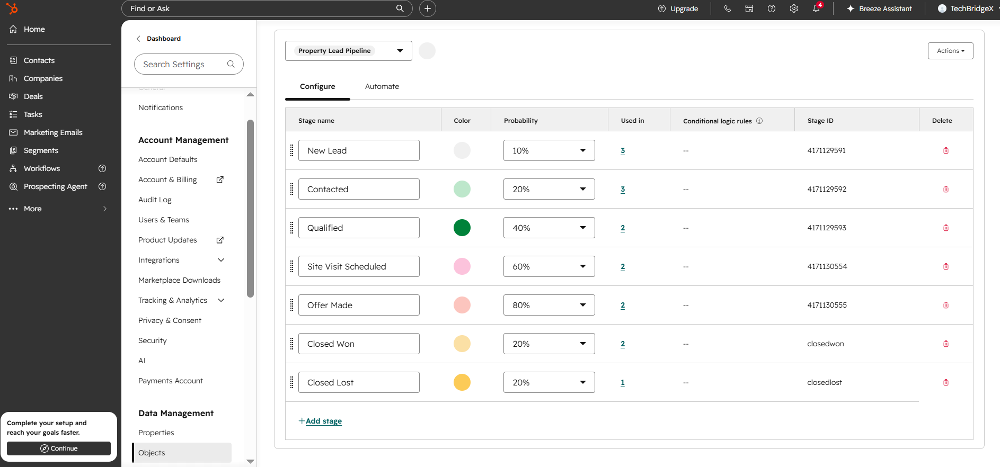
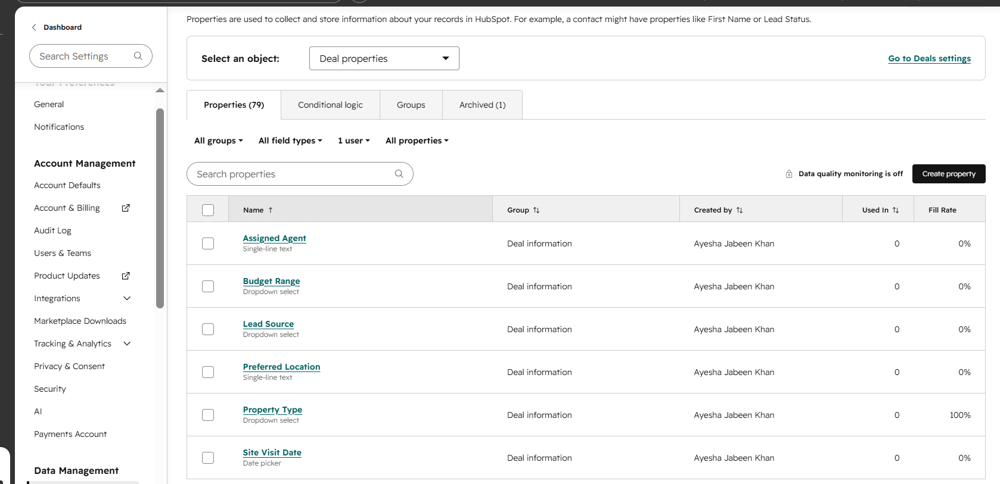
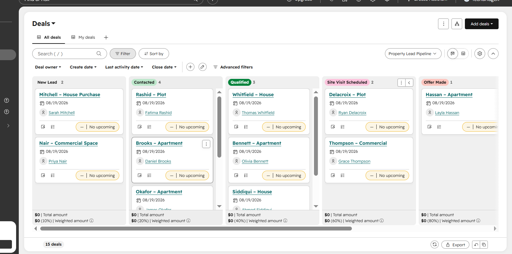
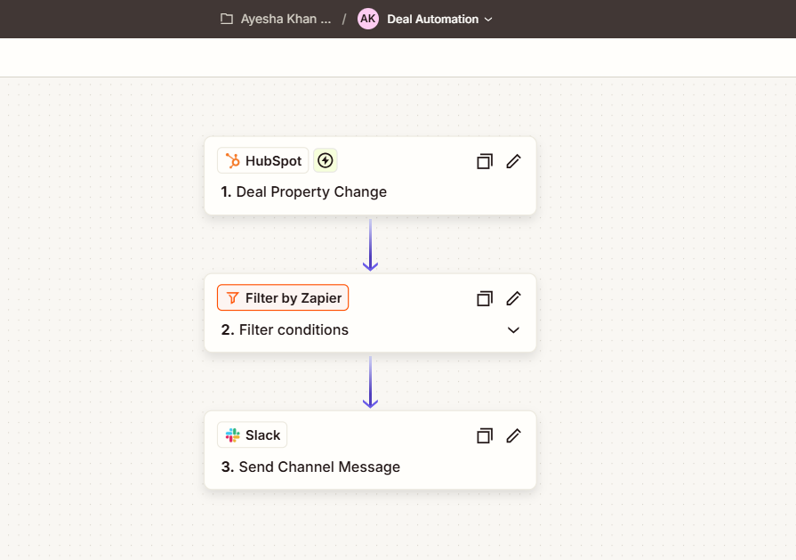
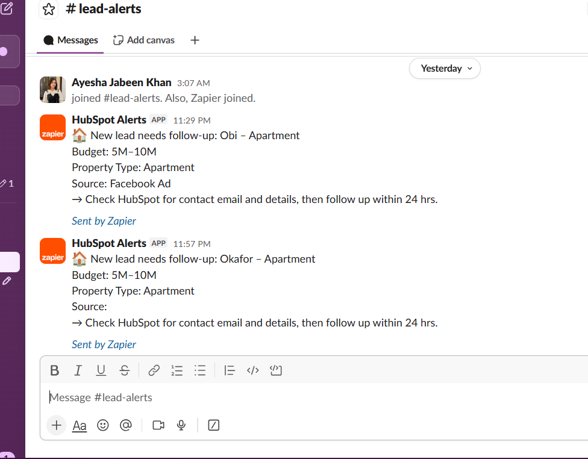

# Real Estate CRM Pipeline + Automated Lead Alerts

Hey there! This project is a custom HubSpot CRM setup built specifically for real estate sales pipelines, paired with a real-time Slack alert system using Zapier. I built this to tackle the most common bottleneck in real estate sales: leads going cold because the team didn't follow up fast enough.

## The Problem

In real estate, deals are usually lost because of slow response times rather than a lack of interest. If a hot lead sits untouched for even a few hours, they'll likely move on to a competitor. I wanted to design a reliable workflow where the second a lead engages (moving into the "Contacted" stage), the entire sales team gets pinged instantly.

## What I Built

### 1. Custom Deal Pipeline
I configured a 7-stage pipeline tailored to match a standard property buying journey:
New Lead → Contacted → Qualified → Site Visit Scheduled → Offer Made → Closed Won / Closed Lost

### 2. Tailored Data Model
Default CRM fields aren't enough for property sales, so I created custom properties across both Deals and Contacts to capture crucial context:
- Budget Range
- Property Type (Apartment, House, Plot, Commercial)
- Lead Source (Facebook Ad, Referral, Website, Instagram, Walk-in)
- Site Visit Date

### 3. Realistic Sample Data
To make sure it looks like a living workspace rather than an empty template, I populated 15 realistic contacts and deals distributed across all pipeline stages.

### 4. Automated Lead Routing (HubSpot → Zapier → Slack)
Whenever a deal changes stages, Zapier catches the update, filters it specifically for the "Contacted" stage via a backend ID match, and instantly fires a formatted notification into a dedicated Slack channel (`#lead-alerts`). It includes the deal name, budget, property type, and source so agents can act immediately.

*Note on tool limits:* HubSpot’s free tier doesn't support native workflow triggers, and Zapier's free plan doesn't include a native delay action. Because of this, my current setup fires *instantly* on stage change. In an enterprise environment using paid tiers (Sales Hub Starter+ and Zapier paid), I'd implement a 3-day inactivity check to ensure alerts only trigger when a lead genuinely stalls. This build proves the core event-driven logic end-to-end.

## Tech Stack
- **HubSpot CRM** (Free Tier)
- **Zapier** (Free Plan + Filters)
- **Slack** (API & Webhooks)

## Future Upgrades (Paid Tier Architecture)
- Add a 3-day delay timer with an "no-activity" filter to catch stalled deals.
- Implement round-robin lead auto-assignment based on budget and source.
- Build custom lead scoring models based on user engagement metrics.
- Trigger urgent SMS alerts alongside Slack notifications.
